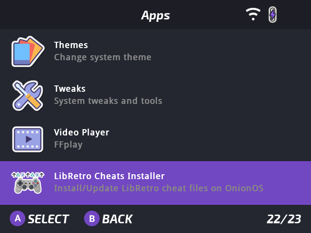
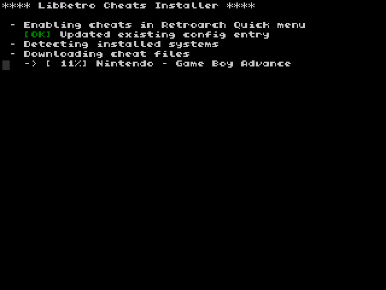

# LibRetro Cheats Installer for OnionOS

**LibRetro Cheats Installer** is a simple [OnionOS](https://onionui.github.io/) app that downloads and installs `.cht` cheat files from the [libretro-database](https://github.com/libretro/libretro-database) for supported emulation systems on your Miyoo Mini Plus device.

  
  

## Features

- Automatically detects enabled systems
- Downloads only relevant `.cht` files from GitHub
- Enables the "cheats" option in the RetroArch Quick menu

## Installation and Usage

1. [Download the latest release](https://github.com/Josh5/onion-libretro-cheats-installer/releases/download/latest/LibRetroCheatsInstaller.zip)
2. Extract the `LibRetroCheatsInstaller` directory into the `App` folder on your OnionOS SD card.
3. Launch the app from the Onion main menu.
4. The app will automatically:
   - Detect enabled systems from the `Roms/` directory
   - Download and install the corresponding `.cht` cheat files
   - Enable the `quick_menu_show_cheats` option in your `retroarch.cfg`
5. To cancel at any time, press the `Menu` key to return to the Onion UI.

## License

This project is licensed under the terms of the  
**GNU General Public License v3.0**  
See [`LICENSE`](./LICENSE) for full details.
